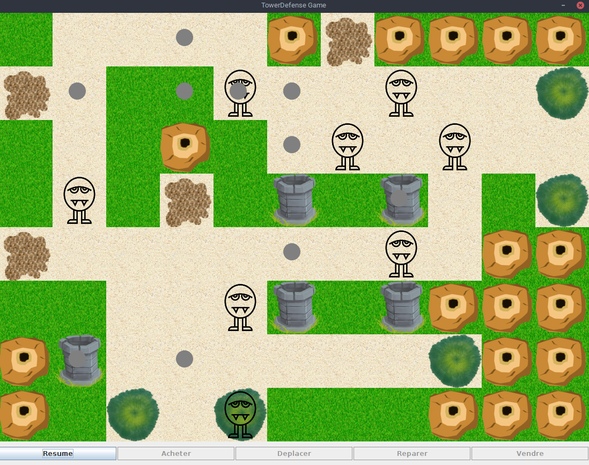
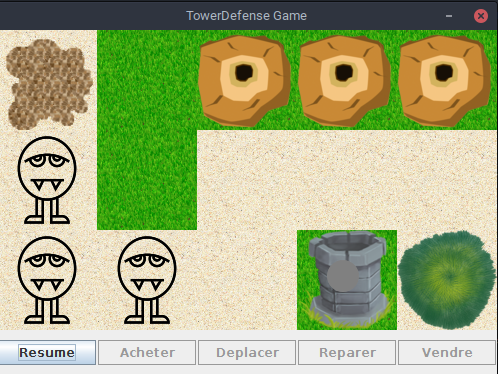
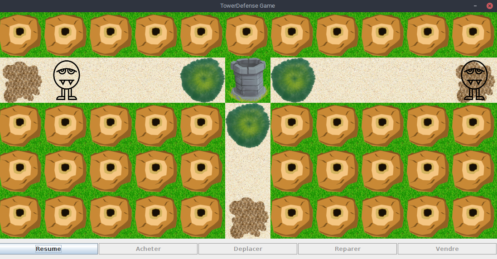
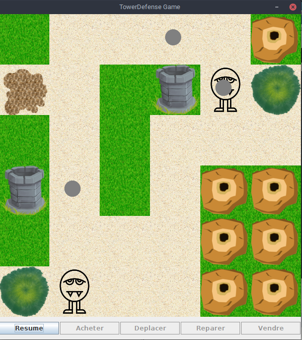

# Lancement des exemples
```./run.sh <nom_exemple>```

où nom exemple est le nom d'une application du package `exemples` du répertoire `src` (e.g ExempleBloque)
# Exemples

- Exemple 1

- Exemple 2


- Exemple 3


- Exemple 4

